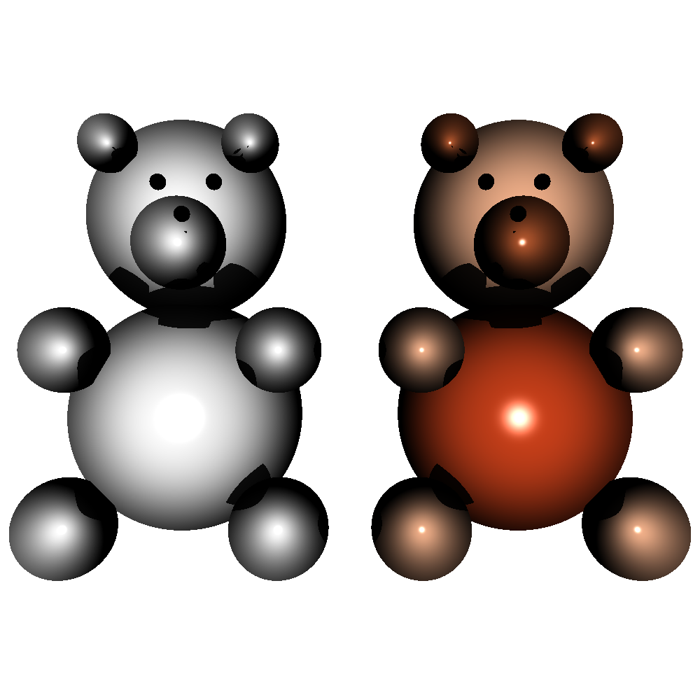

# RT1-Esferas

## Objetivos:

    Que los estudiantes hagan la implementen de un Phong Reflection Model
    Que aprendan sobre el comportamiento de las sombras

## Requerimientos:

Para obtener la nota completa de ésta tarea deben entregar lo siguiente:

    Código fuente capaz de renderizar esferas con un Phong Reflection model
    Render de ejemplo que se vea como la imagen adjunta: [I'm a relative reference to a repository file](./DSC_7802.JPG)

La figura debe ser cargada en el centro de la pantalla y debe ser completamente visible

## Resultado:

